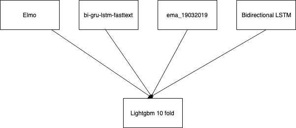

Our approach to the problem is summarised here 

 <br>


# 1. Prerequisite and dependencies
## 1.1 Packages
- tqdm
- pandas
- numpy
- keras

The exact version of these packages are unknown because all those scripts run fully on Kaggle Kernel. The details can be found in Kaggle latest Docker container

## 1.2 Embeddings
- GoogleNews-vectors-negative300
- glove.840B.300d
- paragram_300_sl999
- wiki-news-300d-1M

All these embedding files could be found at this [link](https://www.kaggle.com/dttung2905/popular-embedding) 


# 2. Model architecture
## 2.1 BiDirectional LSTM
This script focuses on the embedding rather than model architecture. Inspired by this [script](https://www.kaggle.com/wowfattie/3rd-place)


- We perform spelling correction
- Find all correction that are one edit away from the 'correct' word
- Find all edits that are two edits away from the 'correct' word
- Use stemming, lemmatization, capitalize, lower, uppercase, as well as embedding of the nearest word using a spell checker to get embeddings for all words in

## 2.2 EMA_19032019
Average ensemble of the same network 
```
Embedding(max_features, 600)
Linear(in_features=600, out_features=128, bias=True)
ReLU()
GRU(128, 128, batch_first=True, bidirectional=True)
GlobalMaxPooling1D()
Linear(in_features=256, out_features=256, bias=True)
ReLU()
Linear(in_features=256, out_features=1, bias=True)
```

Highlighted techniques:

- Calculate exponential moving average of weights during training. Usually done on a minibatch level. We use 10 updates per epoch to reduce the run time

Relevance research paper

- [1] A. Tarvainen and H. Valpola(2017) Mean teachers are better role models: Weight-averaged consistency targets improve semi-supervised deep learning results.

- [2] Yu, A. W., Dohan, D., Luong, M.-T., Zhao, R., Chen, K., Norouzi, M., and Le, Q. V.(2018) QANet: Combining local convolution with global self-attention for reading comprehension

- [3] Minjoon Seo, Aniruddha Kembhavi, Ali Farhadi, and Hannaneh Hajishirzi (2016) Bidirectional attention flow for machine comprehension.

- [4] Douwe Kiela, Changhan Wang, Kyunghyun Cho (2018) Dynamic Meta-Embeddings for Improved Sentence Representations

## 2.3 BiGRU-LSTM Fasttext
Model architecture, inspired from this [script](https://www.kaggle.com/tunguz/bi-gru-lstm-cnn-poolings-fasttext/comments) 

```
__________________________________________________________________________________________________
Layer (type)                    Output Shape         Param #     Connected to                     
==================================================================================================
input_1 (InputLayer)            (None, 220)          0                                            
__________________________________________________________________________________________________
embedding_1 (Embedding)         (None, 220, 300)     22716000    input_1[0][0]                    
__________________________________________________________________________________________________
spatial_dropout1d_1 (SpatialDro (None, 220, 300)     0           embedding_1[0][0]                
__________________________________________________________________________________________________
bidirectional_1 (Bidirectional) (None, 220, 224)     277536      spatial_dropout1d_1[0][0]        
__________________________________________________________________________________________________
bidirectional_2 (Bidirectional) (None, 220, 224)     370048      spatial_dropout1d_1[0][0]        
__________________________________________________________________________________________________
conv1d_1 (Conv1D)               (None, 219, 56)      25144       bidirectional_1[0][0]            
__________________________________________________________________________________________________
conv1d_2 (Conv1D)               (None, 219, 56)      25144       bidirectional_2[0][0]            
__________________________________________________________________________________________________
global_average_pooling1d_1 (Glo (None, 56)           0           conv1d_1[0][0]                   
__________________________________________________________________________________________________
global_max_pooling1d_1 (GlobalM (None, 56)           0           conv1d_1[0][0]                   
__________________________________________________________________________________________________
global_average_pooling1d_2 (Glo (None, 56)           0           conv1d_2[0][0]                   
__________________________________________________________________________________________________
global_max_pooling1d_2 (GlobalM (None, 56)           0           conv1d_2[0][0]                   
__________________________________________________________________________________________________
concatenate_1 (Concatenate)     (None, 224)          0           global_average_pooling1d_1[0][0] 
                                                                 global_max_pooling1d_1[0][0]     
                                                                 global_average_pooling1d_2[0][0] 
                                                                 global_max_pooling1d_2[0][0]     
__________________________________________________________________________________________________
dense_1 (Dense)                 (None, 58)           13050       concatenate_1[0][0]              
==================================================================================================
```


# 3.Model Stacking

We do weighted average of all model out put to have a 58x58 matrix as our input for the lightgbm model
The input to the model can be found [here](https://www.kaggle.com/dttung2905/ensembling-ndsc)

- StratifiedKfold with  10fold was used to have the same distribution of classes in the fold. This is due to class imbalance from the questios
- Number of boosting round is set to be at 700. After 700 rounds with learning rate of 0.002 , the error rate starts to increase tremendously 
